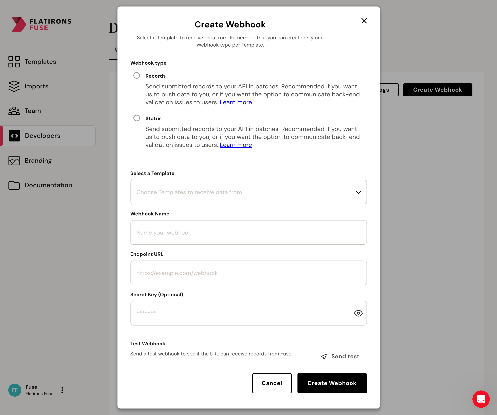

When creating webhooks, you have the option to provide a secret key for added security. This secret key is used to generate a signature for each outgoing payload. To ensure the integrity of incoming webhook payloads, you can validate the signature on your server.



To add a Webhook, go to the [Developers tab](https://fuse.flatirons.com/account/developers) of your Fuse account.

## Providing a Secret Key

When creating or configuring a webhook, include a secret key in the webhook settings. This key is a shared secret between our server and the recipient of the webhook.

## Signature Generation

The signature is generated using the HMAC (Hash-based Message Authentication Code) algorithm with SHA-256. The process involves creating a hexdigest using the secret key and the raw payload of the webhook.

## Signature Verification

To validate the incoming webhook payload, you need to generate the signature on your end using the same process and compare it with the signature provided in the incoming request.

### Signature Validation Code

Below are code snippets in various programming languages to help you validate webhook signatures:

<CodeGroup>

```typescript Node.js (Nest.js / Express.js)
import * as crypto from 'crypto';

function validateSignature(secretKey: string, rawPayload: string, receivedSignature: string): boolean {
  const expectedSignature = crypto.createHmac('sha256', secretKey).update(rawPayload).digest('hex');
  return receivedSignature === expectedSignature;
}
```

```ruby Ruby
require 'openssl'

def validate_signature(secret_key, raw_payload, received_signature)
  expected_signature = OpenSSL::HMAC.hexdigest(
    OpenSSL::Digest.new('sha256'),
    secret_key,
    raw_payload
  )
  received_signature == expected_signature
end
```

```php PHP (Laravel)
use Illuminate\Support\Facades\Request;
use Illuminate\Support\Facades\Hash;

function validateSignature($secretKey, $rawPayload, $receivedSignature) {
  $expectedSignature = Hash::hmac('sha256', $rawPayload, $secretKey);
  return hash_equals($expectedSignature, $receivedSignature);
}
```

```python Python
import hashlib
import hmac

def validate_signature(secret_key, raw_payload, received_signature):
    expected_signature = hmac.new(secret_key.encode('utf-8'), raw_payload.encode('utf-8'), hashlib.sha256).hexdigest()
    return received_signature == expected_signature
```

```java Java (Spring boot)
import javax.crypto.Mac;
import javax.crypto.spec.SecretKeySpec;
import java.security.InvalidKeyException;
import java.security.NoSuchAlgorithmException;

public class WebhookValidator {

    public static boolean validateSignature(String secretKey, String rawPayload, String receivedSignature) {
        try {
            Mac hmac = Mac.getInstance("HmacSHA256");
            SecretKeySpec secretKey = new SecretKeySpec(secretKey.getBytes(), "HmacSHA256");
            hmac.init(secretKey);

            byte[] hashBytes = hmac.doFinal(rawPayload.getBytes());
            String expectedSignature = bytesToHex(hashBytes);

            return receivedSignature.equals(expectedSignature);
        } catch (NoSuchAlgorithmException | InvalidKeyException e) {
            e.printStackTrace(); // Handle the exception according to your needs
            return false;
        }
    }

    private static String bytesToHex(byte[] bytes) {
        StringBuilder hexStringBuilder = new StringBuilder();
        for (byte b : bytes) {
            hexStringBuilder.append(String.format("%02x", b));
        }
        return hexStringBuilder.toString();
    }
}
```

```cs C#
using System.Security.Cryptography;
using System.Text;

public class WebhookValidator
{
    public static bool ValidateSignature(string secretKey, string rawPayload, string receivedSignature)
    {
        using (var hmac = new HMACSHA256(Encoding.UTF8.GetBytes(secretKey)))
        {
            var expectedSignature = BitConverter.ToString(hmac.ComputeHash(Encoding.UTF8.GetBytes(rawPayload))).Replace("-", "").ToLower();
            return receivedSignature == expectedSignature;
        }
    }
}
```
</CodeGroup>

Remember to replace secretKey, rawPayload, and receivedSignature with the actual values from your webhook payload and headers. Incorporate these functions into your webhook endpoint to verify incoming requests.

### Signature Validation Usage Example

Below are code snippets in various programming languages to help you understand how to use the validation method:

<CodeGroup>

```typescript Node.js (Nest.js / Express.js)
import * as crypto from 'crypto';

function validateSignature(secretKey: string, rawPayload: string, receivedSignature: string): boolean {
  const expectedSignature = crypto.createHmac('sha256', secretKey).update(rawPayload).digest('hex');
  return receivedSignature === expectedSignature;
}

app.post('/webhook', (req, res) => {
  // Retrieve the signature from the headers
  const receivedSignature = req.headers['http_x_fuse_signature_256'];

  const secretKey = 'your_secret_key';

  const isSignatureEqual = validateSignature(secretKey, JSON.stringify(req.body), receivedSignature);

  // Compare the signatures
  if (!isSignatureEqual) {
      return res.status(401).send('Mismatched signatures');
  }

  // Process the webhook payload
  // ...

  res.status(200).send({ status: 'complete' });
});
```

```ruby Ruby
require 'openssl'

class WebhookController < ApplicationController
  skip_before_action :verify_authenticity_token

  def validate_signature(secret_key, raw_payload, received_signature)
    expected_signature = OpenSSL::HMAC.hexdigest(
      OpenSSL::Digest.new('sha256'),
      secret_key,
      raw_payload
    )
    received_signature == expected_signature
  end

  def webhook
    received_signature = request.headers['HTTP_X_FUSE_SIGNATURE_256']

    secret_key = 'your_secret_key'

    is_signature_equal = validate_signature(secret_key, request.raw_post, received_signature)

    unless is_signature_equal
      return render json: { error: 'Mismatched signatures' }, status: :unauthorized
    end

    # Process the webhook payload
    # ...

    render json: { status: 'complete' }
  end
end
```

```php PHP (Laravel)
namespace App\Http\Controllers;

use Illuminate\Support\Facades\Request;
use Illuminate\Support\Facades\Hash;

class WebhookController extends Controller
{
  function validateSignature($secretKey, $rawPayload, $receivedSignature) {
    $expectedSignature = Hash::hmac('sha256', $rawPayload, $secretKey);
    return hash_equals($expectedSignature, $receivedSignature);
  }

  public function webhook(Request $request)
  {
      $receivedSignature = $request->header('http_x_fuse_signature_256');

      $secretKey = 'your_secret_key';

      $isSignatureEqual = $this->validateSignature($secretKey, $request->getContent(), $receivedSignature);

      if (!$isSignatureEqual) {
          return response()->json(['error' => 'Mismatched signatures'], 401);
      }

      // Process the webhook payload
      // ...

      return response()->json(['status' => 'complete']);
  }
}
```

```python Python
from flask import Flask, request, jsonify
import hashlib
import hmac

def validate_signature(secret_key, raw_payload, received_signature):
    expected_signature = hmac.new(secret_key.encode('utf-8'), raw_payload.encode('utf-8'), hashlib.sha256).hexdigest()
    return received_signature == expected_signature

@app.route('/webhook', methods=['POST'])
def webhook():
    received_signature = request.headers.get('HTTP_X_FUSE_SIGNATURE_256')

    secret_key = 'your_secret_key'

    is_signature_equal = validate_signature(secret_key, request.get_data(), received_signature)

    if not is_signature_equal:
        return 'Mismatched signatures', 401

    # Process the webhook payload
    # ...

    return jsonify({'status': 'complete'})
```

```java Java (Spring boot)
import org.springframework.http.HttpStatus;
import org.springframework.http.ResponseEntity;
import org.springframework.web.bind.annotation.PostMapping;
import org.springframework.web.bind.annotation.RequestBody;
import org.springframework.web.bind.annotation.RequestHeader;
import org.springframework.web.bind.annotation.RestController;

import javax.crypto.Mac;
import javax.crypto.spec.SecretKeySpec;
import java.security.InvalidKeyException;
import java.security.NoSuchAlgorithmException;

public class WebhookController {

    public static boolean validateSignature(String secretKey, String rawPayload, String receivedSignature) {
        try {
            Mac hmac = Mac.getInstance("HmacSHA256");
            SecretKeySpec secretKey = new SecretKeySpec(secretKey.getBytes(), "HmacSHA256");
            hmac.init(secretKey);

            byte[] hashBytes = hmac.doFinal(rawPayload.getBytes());
            String expectedSignature = bytesToHex(hashBytes);

            return receivedSignature.equals(expectedSignature);
        } catch (NoSuchAlgorithmException | InvalidKeyException e) {
            e.printStackTrace(); // Handle the exception according to your needs
            return false;
        }
    }

    private static String bytesToHex(byte[] bytes) {
        StringBuilder hexStringBuilder = new StringBuilder();
        for (byte b : bytes) {
            hexStringBuilder.append(String.format("%02x", b));
        }
        return hexStringBuilder.toString();
    }

    @PostMapping("/webhook")
    public ResponseEntity<?> webhook(@RequestBody String requestBody, @RequestHeader("http_x_fuse_signature_256") String receivedSignature) {
        String secretKey = "your_secret_key";

        boolean isSignatureEqual = validateSignature(secretKey, requestBody, receivedSignature);

        if (!isSignatureEqual) {
            return ResponseEntity.status(HttpStatus.UNAUTHORIZED).body("Mismatched signatures");
        }

        // Process the webhook payload
        // ...

        return ResponseEntity.ok().body("{\"status\": \"complete\"}");
    }

}
```

```cs C#
using Microsoft.AspNetCore.Mvc;
using System.Security.Cryptography;
using System.Text;

public class WebhookController
{
    public static bool ValidateSignature(string secretKey, string rawPayload, string receivedSignature)
    {
        using (var hmac = new HMACSHA256(Encoding.UTF8.GetBytes(secretKey)))
        {
            var expectedSignature = BitConverter.ToString(hmac.ComputeHash(Encoding.UTF8.GetBytes(rawPayload))).Replace("-", "").ToLower();
            return receivedSignature == expectedSignature;
        }
    }

    [HttpPost("/webhook")]
    public IActionResult Webhook([FromBody] string requestBody, [FromHeader(Name = "HTTP_X_FUSE_SIGNATURE_256")] string receivedSignature)
    {
        string secretKey = "your_secret_key";

        bool isSignatureEqual = ValidateSignature(secretKey, requestBody, receivedSignature);

        if (!isSignatureEqual)
        {
            return Unauthorized("Mismatched signatures");
        }

        // Process the webhook payload
        // ...

        return Ok(new { status = "complete" });
    }
}
```
</CodeGroup>