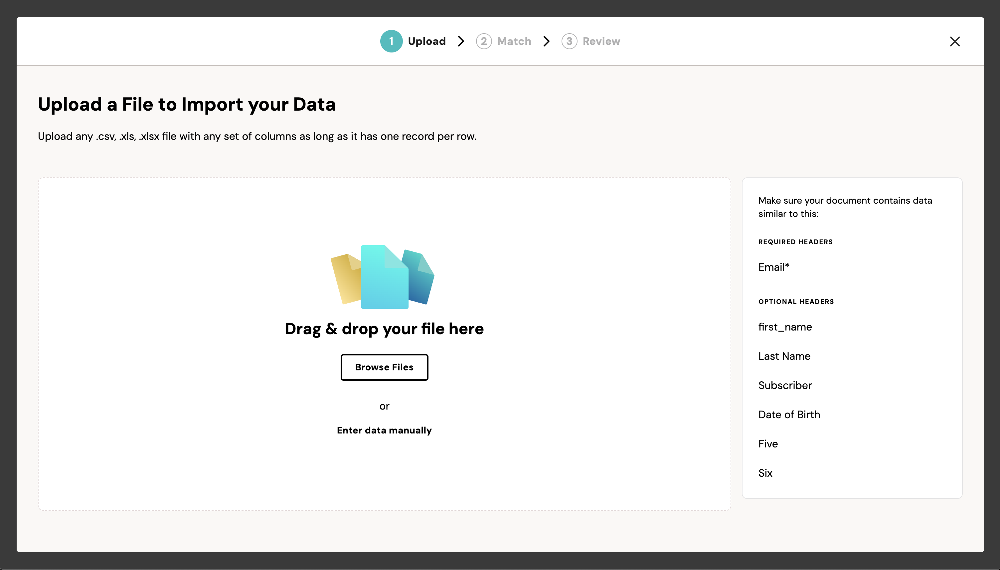

Fuse has built-in support for launching the importer within a modal. Simply pass the `modal: true` option when you instantiate your importer.

```javascript
const importerOptions = {
  modal: true 
};

const importer = new FuseImporter(
  organizationApiKey, 
  importerId, 
  importerOptions
);

importer.show();
```


