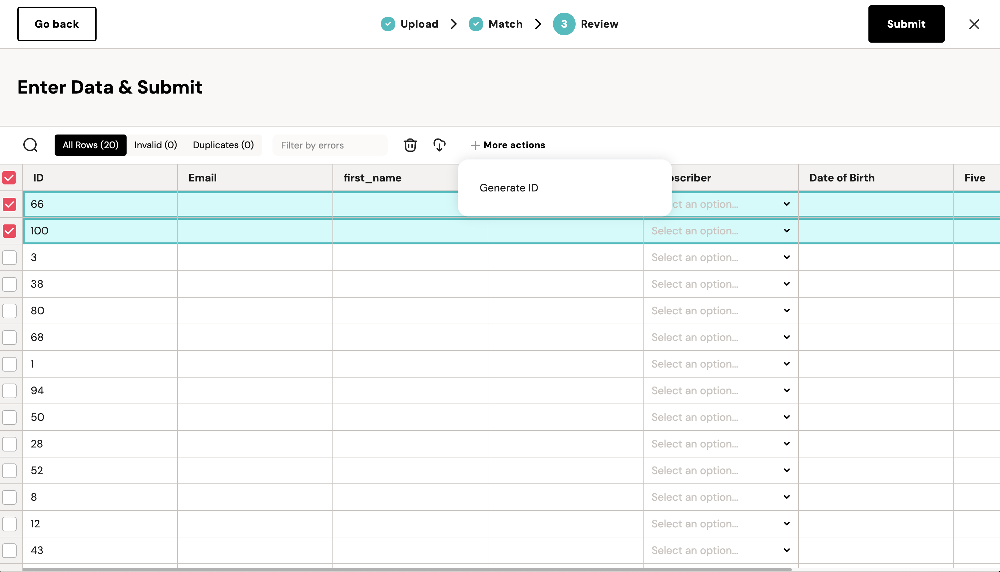

Developers can add bulk action functionality to the importer using Custom Actions. See the preview below for an example.

## addCustomAction

The `addCustomAction` function accepts an object as an argument with the following properties:

- `action_type` (String) - required: Currently must be set to "record".
- `name` (String) - required: A succinct description of the action.
- `handler` (Function) - required: A function that takes a `record` and manipulates it when the action is performed.

<Note>
  Custom actions are hidden in the UI until you select a row in the spreadsheet.  
</Note>


## Example Code

```javascript
const importer = new FuseImporter(organizationApiKey, importerId);

importer.addCustomAction({
  actionType: "record",
  name: "Generate ID",
  handler: (record) => {
    record['id'] = Math.random();
    return record;
  }
});

importer.show();
```

## Preview

What a custom action called "Generate ID" would look like.

