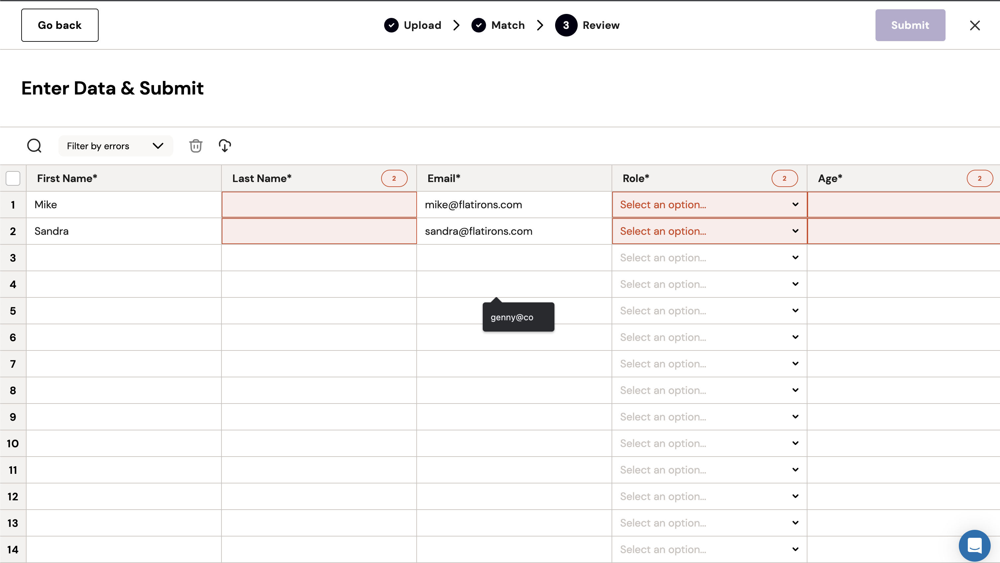

The spreadsheet UI Fuse can be used to edit data in bulk. All of the functionality in Fuse outside of uploading and transforming CSV files is useful for bulk editing, including:

- Front-end Data Validations
- Back-end Data Validations
- Data Transformations
- Bulk Actions
- and more.

To use Fuse as a bulk editing tool, set the `records` property on your importer before launching it. This will force the importer to skip the CSV file upload process and allow the user to edit the records.

```javascript
const options = {
  records: [
    { name: "Mike", email: "mike@email.com" },
    { name: "Sandra", email: "sandra@mail.com" },
  ],
};

const importer = new FuseImporter(apiToken, templateSlug, { ...options });

// add columns, validations, and transformations here

importer.show();
```

## Preview


