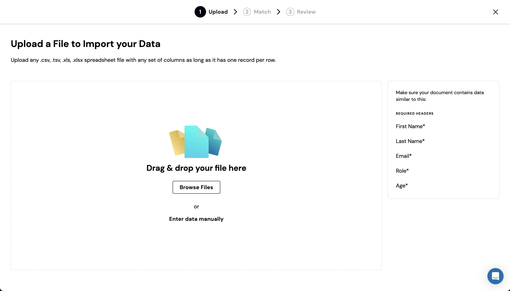

Importing CSV files is the default use case for Fuse. There is no special configuration needed if you are using Fuse for importing CSV files. Simply [launch your importer](/getting-started/embedding#launching-an-importer), and the user will be prompted to import a CSV file.

## Preview

